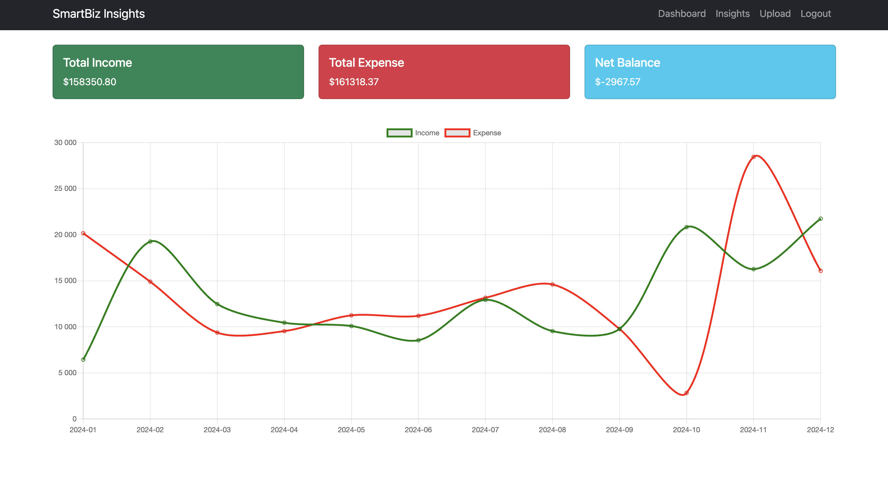
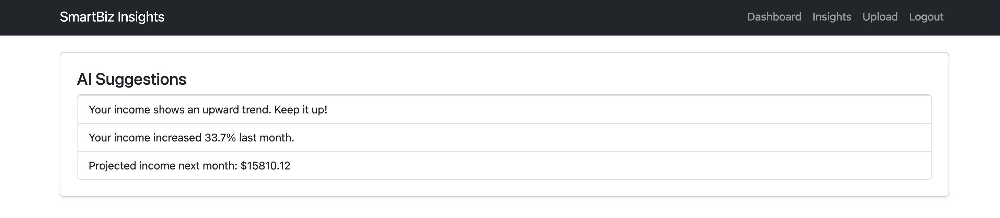
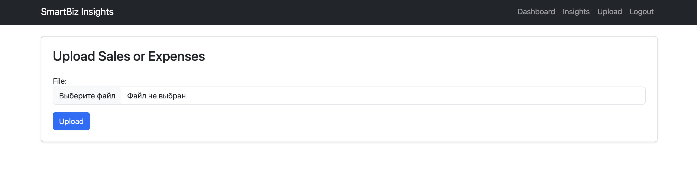

# 📊 SmartBiz Insights

A **Small Business Analytics Dashboard** built with **Django + PostgreSQL + Pandas + DRF + Scikit-learn**.  
Track sales and expenses, visualize KPIs, and get **AI-powered business insights** from your uploaded data.  

<p align="center">
  
  
  
</p>

---

## ✨ Features

- ✅ User authentication (employees upload their own data, see only their records)  
- ✅ Upload **CSV / Excel** transaction files  
- ✅ Data parsing & validation with **Pandas**  
- ✅ KPI dashboard with **income, expenses, net profit**  
- ✅ Interactive charts with **Chart.js**  
- ✅ **AI Suggestions**: revenue trends, monthly change alerts, volatility checks, income forecast  
- ✅ REST API with **Django REST Framework (DRF)**  
- ✅ Unit tests for critical logic (upload, KPIs, API)  
- ✅ Dockerized environment (Python + PostgreSQL)  
- ✅ Continuous Integration (CI) with **GitHub Actions** (Linting + Tests)  

---

## 🛠️ Tech Stack

- **Backend**: Django 5, Django REST Framework  
- **Database**: PostgreSQL 15  
- **Data Processing**: Pandas, Scikit-learn  
- **Frontend**: Bootstrap 5, Chart.js  
- **Deployment**: Docker & Docker Compose  
- **Tests**: Django’s built-in `TestCase`  
- **CI/CD**: GitHub Actions (flake8 + tests)  

---

## 📂 Project Structure

```
PetProject/
├── Docker/                     # Docker-related files
│   ├── .env
│   ├── Dockerfile
│   ├── docker-compose.yml
│   └── requirements.txt
│
├── docs/                       # Documentation and screenshots
│   ├── dashboard.png
│   ├── insights.png
│   └── upload.png
│
├── PetProject/
│   ├── accounts/               # User authentication (login/logout)
│   │   ├── migrations/
│   │   ├── templates/
│   │   │   └── registration/   # Login/Logout templates
│   │   │       ├── login.html
│   │   │       └── logged_out.html
│   │   ├── admin.py
│   │   ├── apps.py
│   │   ├── models.py
│   │   ├── tests.py
│   │   ├── urls.py
│   │   └── views.py
│   │
│   ├── analytics/              # Business analytics app
│   │   ├── api/                # REST API (DRF endpoints)
│   │   │   ├── api_urls.py
│   │   │   ├── api_views.py
│   │   │   └── serializers.py
│   │   ├── migrations/
│   │   ├── templates/
│   │   │   └── analytics/      # Analytics templates
│   │   │       ├── dashboard.html
│   │   │       ├── insights.html
│   │   │       └── upload.html
│   │   ├── templatetags/       # Custom template filters
│   │   │   └── form_filters.py
│   │   ├── tests/              # Unit tests
│   │   │   └── test_upload.py
│   │   ├── ai.py               # AI logic for insights
│   │   ├── admin.py
│   │   ├── apps.py
│   │   ├── forms.py
│   │   ├── models.py
│   │   ├── urls.py
│   │   └── views.py
│   │
│   ├── templates/              # Shared templates (base.html)
│   │   └── base.html
│   │
│   ├── conf/                   # Django project settings
│   │   ├── asgi.py
│   │   ├── settings.py
│   │   ├── urls.py
│   │   └── wsgi.py
│   │
│   ├── manage.py
│
├── .github/
│   └── workflows/
│       └── ci.yml              # GitHub Actions workflow (Lint + Tests)
│
├── .gitignore
├── README.md
```

---

## 🚀 Getting Started

### 1. Clone repository
```bash
git clone https://github.com/dziubaaleksandr/PetProject.git
cd smartbiz-insights/Docker
```

### 2. Configure environment
Create `.env` inside `Docker/`:
```env
DB_NAME=smartbiz
DB_USER=smartbiz
DB_PASSWORD=secret
DB_HOST=db
DB_PORT=5432
```

### 3. Build & start containers
```bash
docker-compose up -d --build
```

### 4. Run migrations & create superuser
```bash
docker exec -it django-app python manage.py migrate
docker exec -it django-app python manage.py createsuperuser
```

### 5. Open in browser
- App: [http://127.0.0.1:8000/](http://127.0.0.1:8000/)  
- API: [http://127.0.0.1:8000/api/](http://127.0.0.1:8000/api/)  
- Admin: [http://127.0.0.1:8000/admin/](http://127.0.0.1:8000/admin/)  

---

## 📡 API Endpoints

| Endpoint                  | Method | Description |
|----------------------------|--------|-------------|
| `/api/transactions/`      | GET    | List user’s transactions |
| `/api/transactions/`      | POST   | Upload a transaction |
| `/api/kpis/`              | GET    | Get income/expense/net summary |
| `/api/insights/`          | GET    | AI-powered insights |

---

## 🧪 Running Tests

```bash
docker exec -it django-app python manage.py test
```

---

## 🔄 Continuous Integration (CI)

This project uses **GitHub Actions** for Continuous Integration:  
- ✅ Linting with **flake8**, **pylint**, **black**, **isort**  
- ✅ Running Django unit tests inside CI  

Workflow file: `.github/workflows/ci.yml`

---

## 🎯 Why this project?

This project demonstrates **middle Python developer skills**:

- Designing clean Django apps (accounts, analytics, API split)  
- Working with **PostgreSQL** & Django ORM queries (`annotate`, `aggregate`)  
- Integrating **Pandas** & **Scikit-learn** into Django workflow  
- Building both **UI dashboard** and **REST API**  
- Writing **unit tests** and using Docker for reproducibility  
- Setting up **CI with GitHub Actions**  
- Following a phased roadmap (professional development approach)  

---

💡 *Built as a portfolio project to showcase Django, data analytics, and ML integration skills.*  
